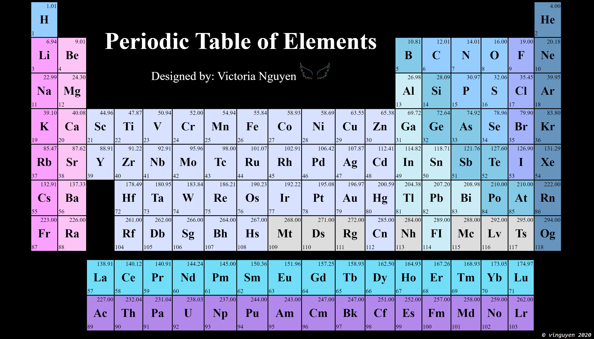

# Periodic Table of Elements

Create a webpage that represents Dimitri Mendeleïev complete periodic table of the
elements (the current version). The constraints are as follows:
- [x] Contain at least one image for embellishment
- [x] Beautiful design (eg. colors)
- [x] Each box in the periodic table contains: atomic number (lower left), element (middle), and atomic weight (top right)
- [x] The information seen in the table must be in a modifiable text 

## Running the code

**1. Git clone the repository in your terminal**

      `git clone https://github.com/VictoriaNguyenMD/42-piscine-php.git`

**2. Move into the repository**

      `cd d00/ex01`

**3. Open the file in your browser**

First try: 

      `open -a "Google Chrome" mendeleive.html`

If this fails, `pwd` in your terminal to get the location of the file. In your browser, type `file:///` and the information gathered from the `pwd`.

