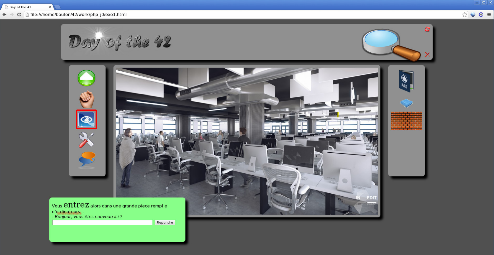

# Day of the 42

Create very precisely and totally identical the page of the fictional game “Day of the 42." To create this, you have a slew of compulsory images that you must use (no more, no less) in the `resources` folder.  Pay attention to all the details, the positioning, the fonts, the colors, the frames... there are also some links and hot links that will direct you to the following sites:

- [x] The reload.png image whose title is “Start from the beginning” will bounce you to
[www.disney.com](https://www.disney.com/).
- [x] close.gif (“Disconnect”) goes to [www.relaischateaux.com](https://www.relaischateaux.com/).
- [x] The actions on the left are respectively named “Advance”, “Take”, “Look”, “Use”, “Speak”. The alt/title must use that name.
- [x] In the central image, a zone on the principal chair in the center (the second one from the right) goes to [www.ikea.com](https://www.ikea.com/) and the biggest screen, from the back, in the lower right corner goes to [www.apple.com](https://www.apple.com/).
- [x] Every object must have a title.
- [] Files to turn in: `doft.html`, `doft.css`, and `resources/`

## Running the code

**1. Git clone the repository in your terminal**

      `git clone https://github.com/VictoriaNguyenMD/42-piscine-php.git`

**2. Move into the repository**

      `cd d00/ex02`

**3. Open the file in your browser**

First try: 

      `open -a "Google Chrome" doft.html`

If this fails, `pwd` in your terminal to get the location of the file. In your browser, type `file:///` and the information gathered from the `pwd`.

## Comparisons

**Example Game Website**

**My Game Website**